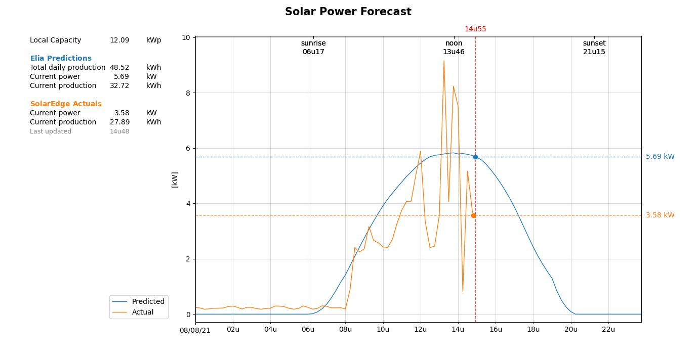

# solar_predictor
Local solar predictions for my dad

Just a small DIY project

## Features
- Read out local solar predictions (provided by Elia for Belgium)
- Recalculate for local site capacity
- Read out actual performance (provided by SolarEdge)
- Create nice graph



## Install

#### Repository
```bash
git clone https://github.com/tomsaenen/solar_predictor.git
```

#### Dependencies
```bash
pip install colorama requests xmltodict pytz pandas scipy matplotlib astral
```

#### SolarEdge API
To access the SolarEdge API an API key is required. This key is read from `solaredge_api.json`:
```json
{
  "api_key": "KEY"
}
```
This file is not included in the repository for privacy reasons.

## Run
Run for today:
```bash
py main.py
```

Run for any day:
```bash
py main.py YYYY-MM-DD
```

Test communication with 3rd parties separately:
```bash
py elia.py
py solaredge.py
py solar.py
```

## TODO
- Display actual total kWh for past days
- Plot today's values when running connectors standalone
- Communicate predictions to PLC via OPC
